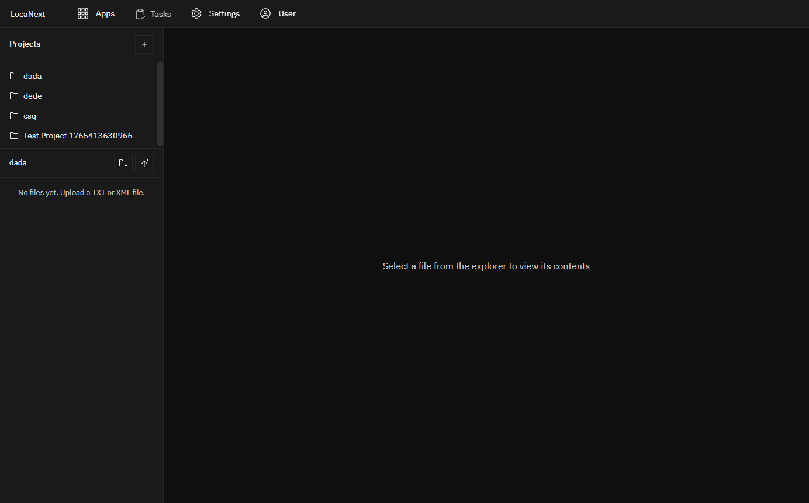

# LDM (LanguageData Manager) Screenshots

**Last Updated:** 2025-12-11
**Status:** Working - All features verified via CDP testing

---

## Screenshots

### Main Screenshot - Full Working View


**Features visible:**
- Project list: dada, dede, csq, Test Project
- File tree: BDO FR folder with SMALLTESTFILEFORQUICKSEARCH.txt
- Grid: 1,183 rows of Korean/French translation pairs
- Status badges: "translated" indicators
- Header: LocaNext with Apps, Tasks, Settings, User navigation

### Project List View

- Auto-loads projects on startup
- Clean sidebar with project names

### File Tree View

- Project selected, file tree expanded
- Shows folder structure and files

---

## Verified Features (2025-12-11)

| Feature | Status | Verification |
|---------|--------|--------------|
| Project list auto-load | Working | CDP test |
| File tree navigation | Working | CDP test |
| File click loads content | Working | CDP test (ISSUE-008 fixed) |
| Grid displays data | Working | 1,183 rows loaded |
| Korean text rendering | Working | Visible in screenshot |
| French translations | Working | Visible in screenshot |
| Status badges | Working | "translated" shown |

---

## How Screenshots Were Captured

Screenshots captured autonomously using CDP (Chrome DevTools Protocol) from WSL:

```bash
# Run via PowerShell (CDP binds to Windows localhost)
/mnt/c/Windows/System32/WindowsPowerShell/v1.0/powershell.exe -Command \
  "cd C:\NEIL_PROJECTS_WINDOWSBUILD; node cdp_screenshot.js output.png"
```

See `docs/troubleshooting/WINDOWS_TROUBLESHOOTING.md` for full CDP testing guide.
